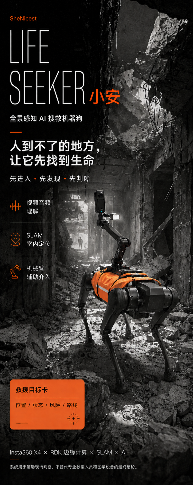
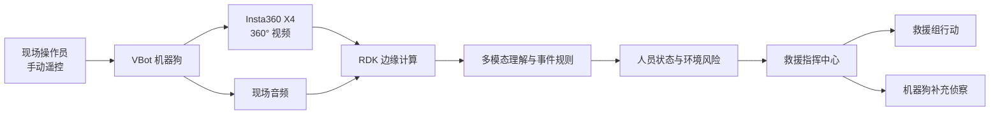

# Rescue Xiaoan

> 人到不了的地方，让它先找到生命。

<p align="center">
  
</p>

Rescue Xiaoan 是一套面向地震与坍塌场景的 360° 多模态智能搜救机器狗系统。机器狗进入人员难以安全抵达的区域，通过全景视频、现场音频和边缘计算持续观察环境；多模态 AI 将零散信息整理为受困人员状态、环境风险、定位线索、救援优先级和下一步行动建议，回传至救援指挥中心。

## 解决的问题

- 救援人员难以快速、安全地进入高风险废墟区域。
- 普通摄像头视野有限，受困人员和危险构件容易处于画面之外或被遮挡。
- 原始视频信息密度高，指挥人员仍需自行判断“发现了谁、谁最危险、接下来做什么”。

## 方案

1. 现场操作员手动遥控 VBot 机器狗进入废墟并执行移动侦察。
2. Insta360 X4 采集 360° 现场视频，麦克风采集现场声音。
3. RDK 处理设备接入、边缘任务和系统通信。
4. 多模态 AI 持续理解视频与音频，识别可观察的人员状态和环境风险。
5. 指挥界面将证据转化为人员队列、并行任务和需人工确认的行动建议。

## 已完成的现场闭环

```text
操作员手动遥控机器狗进入现场
  -> 360° 视频与音频回传
  -> 发现疑似受困人员
  -> 分析可观察状态与环境风险
  -> 生成人员优先级和定位线索
  -> 救援组与机器狗并行执行下一步任务
```

## 演示入口

- [作品演示视频（58 秒）](showcase/videos/rescue-xiaoan-demo.mp4)
- [救援指挥中心模拟用户界面](demo/rescue-command-center/index.html)
- [演示素材与视频说明](showcase/README.md)
- [现场技术源码分区](technical/README.md)

## 系统架构



当前现场演示中，机器狗未开放 SDK，因此移动和绕行由操作员手动遥控完成；指挥中心输出的是侦察任务建议，不会自动驱动机器狗。机械臂因硬件故障未进入本次演示闭环。

更完整的数据流和模块职责见[系统架构](docs/architecture.md)。

## 仓库导航

| 目录 | 内容 |
| --- | --- |
| [`technical/`](technical/README.md) | 相机流、多模态 AI、RDK、机器人控制和系统集成源码 |
| [`demo/`](demo/README.md) | 可直接打开的产品与技术展示界面 |
| [`docs/`](docs/project-overview.md) | 项目、架构、硬件、实现细节与能力边界 |
| [`showcase/`](showcase/README.md) | 演示视频、截图、海报与 UI 素材 |
| [`submission/`](submission/project-description.md) | 黑客松提交说明、路演稿与鸣谢 |

## 能力边界

系统只分析视频和音频中能够观察到的生命迹象与环境信息，不替代专业生命体征传感器、医疗诊断或救援指挥。AI 输出必须由专业人员确认后执行。详见[能力边界](docs/limitations.md)。
