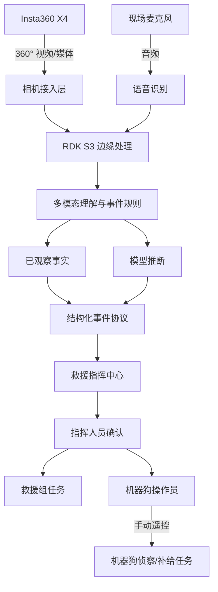

# 系统架构

## 数据流

## 信息分层

- 已观察事实：画面中出现的人、动作、遮挡、构件、通道与可听见的回应。
- 模型推断：疑似意识状态、受困关系、环境风险和信息完整度。
- 行动建议：救援优先级、机器狗补充侦察方向和救援准备建议。
- 人工决策：确认、调整或拒绝 AI 建议后再下发任务。

## 关键原则

- 360° 画面扩大现场覆盖范围，但无法消除实体遮挡。
- 视频与音频共同参与理解；音频需经过转写或特征处理后进入多模态链路。
- 救援组任务和机器狗侦察任务可以并行，不使用容易误解为顺序执行的任务编号。
- 所有高风险行动由专业人员确认，系统不自主替代现场指挥。

## 当前控制边界

VBot 在本次活动中未开放 SDK，因此系统只生成机器狗侦察任务和建议路线，由现场操作员手动遥控执行。机械臂因硬件故障未加入闭环。未来如获得稳定控制接口，可在保留人工确认与急停的前提下接入 `technical/robot-control/`。
